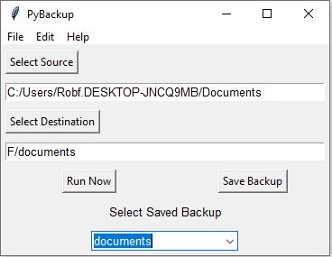

# PyBackup - A simple personal backup utility
*v0.0.1*

Updated: 2023-04-17

## Introduction

**PyPackup** is a simple, no-frills, easy to use personal file backup app.  

## Features
- Backup to a timestamped *.zip file.
- Save backup sources and destinations for easy re-use.

## License
GNU General Public License 3. See the LICENSE file for details.
 
## Installation
- Written in Python 3.11 on Windows 11. Not tested in any other Python versions or operating systems.  I'm confident it can be made to work on Mac and Linux.
- Has no requirements outside the Python standard library.
- Download the repo as a zip file and extract.
- ``python backup.py`` to launch.

## Confguration
- Saved backups are contained in the file ``backups.json``. 
- Manually set the location of this file in ``config.ini`` --> `saved_backups`
  
## Screenshot

## Documentation
- Click the **Select Source** button to choose a directory to back up.
- Click the **Select Destination** button to choose a directory to back up to. A time-stamped ZIP file will be created in this folder.
- Click **Run Now** to execute the backup. A pop up will notify when the backup is completed.
- Click **Save Backup** to save the backup configuration for later use.  The backup will appear by name in the **Select Saved Backup** drop down list.  You will need to re-start PyBackup for new backups to appear on this list.
- To load a saved backup, click on the **Select Saved Backup** drop down list and select the name of the desired backup. The source and destination boxes will populate from the saved backup. You can then click **Run Now** to execute the saved backup.

## Credit
Thanks to John Elder at https://tkinter.com/ for providing a helpful, up-to-date course on Python's tkinter library.
